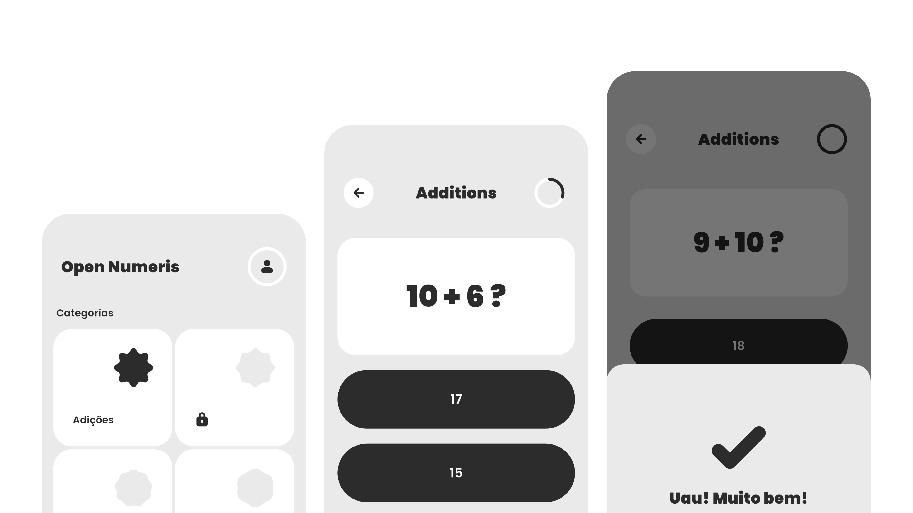

# Open Numeris
Criado por Daniel Pereira (dpnnl)

Núcleo completo (Lógica + Interface) para geração de quizzes matemáticos. O sistema gerencia as 4 operações básicas, progressão de nível do usuário e desbloqueio de categorias.

### ⚠️ Compatibilidade e UI
O projeto é **Mobile-First**
* A interface pode não se adaptar corretamente em navegadores Desktop ou telas grandes.
* Funciona perfeitamente em dispositivos Android ou no Chrome.

### Flutter 💙
Desenvolvido com a versão do 3.35 do Flutter e 3.9 do Dart!

### Estado do Projeto
A base está pronta para ser compilada e executada em dispositivos Android ou no Chrome para desktop.
